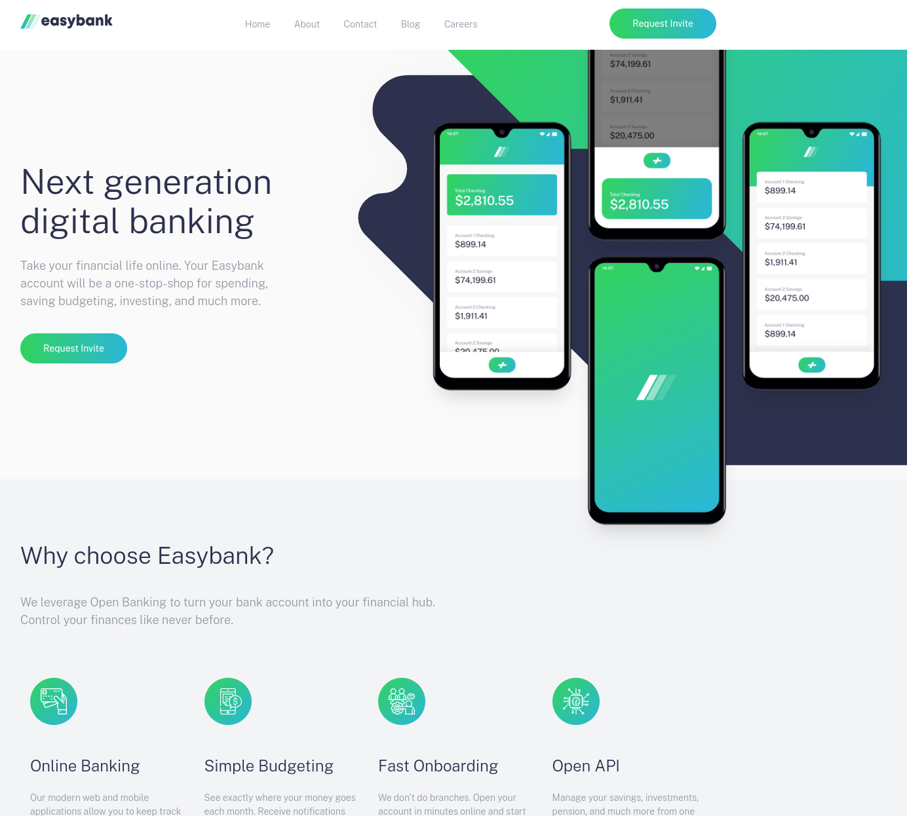

# Frontend Mentor - Easybank landing page solution

This is a solution to the [Easybank landing page challenge on Frontend Mentor](https://www.frontendmentor.io/challenges/easybank-landing-page-WaUhkoDN). Frontend Mentor challenges help you improve your coding skills by building realistic projects.

## Table of contents

- [Overview](#overview)
  - [The challenge](#the-challenge)
  - [Screenshot](#screenshot)
  - [Links](#links)
- [My process](#my-process)
  - [Built with](#built-with)
  - [What I learned](#what-i-learned)
  - [Continued development](#continued-development)
  - [Useful resources](#useful-resources)
- [Author](#author)
- [Acknowledgments](#acknowledgments)

## Overview

### The challenge

Users should be able to:

- View the optimal layout for the site depending on their device's screen size
- See hover states for all interactive elements on the page

### Screenshot

### Links

- Solution URL: [Github](https://github.com/OnTheHook/new-landing-page)
- Live Site URL: [Live](https://main--darling-mousse-ba8f3e.netlify.app/)

## My process

I followed along with a tutorial from the freeCodeCamp YouTube page. This gave me insight into how experienced developers layout a website and the tools they use.

- Tutorial URL: [Tutorial](https://www.youtube.com/watch?v=aoQ6S1a32j8)

### Built with

- Semantic HTML5 markup
- SASS
- CSS custom properties
- Flexbox
- CSS Grid
- JavaScript
- Mobile-first workflow

### What I learned

I learned a lot about responsive design. This challenge along with the tutorial was very instructive. I also learned a lot about media queries, SASS, positioning and how to problem solve when faced with challenges.

### Continued development

I want to focus on responsive layouts and creating my own designs in the future.

### Useful resources

- [Tutorial](https://www.youtube.com/watch?v=aoQ6S1a32j8) - This walked me through the solution and taught me a lot about modern front-end tools and how experienced developers think.
- [Google](https://www.google.com) - Every developer's best friend.

## Author

- Website - [Lawson](https://onthehook.github.io/)
- Frontend Mentor - [@OnTheHook](https://www.frontendmentor.io/profile/OnTheHook)

## Acknowledgments

Thank you freeCodeCamp and The Coder Coder for the great and helpful tutorial.

- [TheCoderCoder](https://www.youtube.com/@TheCoderCoder)
- [freeCodeCamp](https://www.youtube.com/@freecodecamp)
